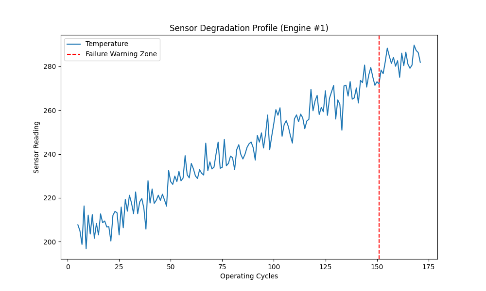

## 🤖 AI-Powered Predictive Maintenance System for IoT Devices
## 📌 Project Overview

This project demonstrates an AI-Powered Predictive Maintenance System for IoT Devices built using Python and Machine Learning.

It simulates an industrial IoT environment where sensor data (temperature, vibration, and current) is continuously monitored to predict machine failures before they occur.

The system replicates real-world predictive maintenance solutions used in smart factories, manufacturing plants, and industrial automation systems.

## 🎯 Problem Statement

In traditional industries, machine maintenance is usually:

Reactive (fix after failure) 
Costly due to downtime 
Inefficient for large-scale systems 

This project solves the problem by:

✔ Predicting machine failures in advance
✔ Reducing unexpected breakdowns
✔ Improving operational efficiency
✔ Enabling smart maintenance decisions using AI

## 🌍 Industry Relevance

Predictive maintenance is widely used in:

🏭 Manufacturing plants
⚙️ Industrial automation systems
🚗 Automotive industry
✈️ Aviation systems
⚡ Power plants
🏢 Smart factories (Industry 4.0)

Companies like GE, Siemens, Bosch, IBM, Tesla, and AWS IoT use similar AI systems for monitoring and maintenance.

## 🧠 Key Features
Real-time IoT sensor simulation (temperature, vibration, current)
Machine failure prediction using Machine Learning
Flask-based API for real-time inference
Automated alert system for failure detection
Data visualization of sensor behavior
Modular and production-style architecture

## 🛠️ Tech Stack
Python 3.x
Pandas & NumPy
Scikit-learn
Matplotlib & Seaborn
Flask (API Deployment)
Joblib (Model Saving)
IoT Simulation (Synthetic Sensor Data)

## 🏗️ System Architecture

Sensor Data (Temperature, Vibration, Current)
↓
Data Preprocessing
↓
Feature Engineering
↓
Machine Learning Model Training
↓
Failure Prediction (0 / 1)
↓
Flask API Deployment
↓
Real-Time Alert System & Visualization

## ⚙️ How It Works
IoT sensor data is collected or simulated
Data is cleaned and preprocessed
Features like temperature, vibration, and current are used
A Machine Learning model is trained on failure patterns
The model predicts whether a machine will fail
Flask API receives real-time sensor input
System generates prediction and triggers alerts

## 📁 Folder Structure
AI-Predictive-Maintenance-IoT/
│
│
├── data/                  
├── notebooks/             
├── src/                   
├── models/                
├── outputs/               
├── images/               
├── docs/                  
├── main.py                
├── requirements.txt       
├── README.md              
└── .gitignore   

## ⚙️ Installation
📌 Step 1: Clone Repository
git clone https://github.com/your-username/AI-Predictive-Maintenance-IoT.git
cd AI-Predictive-Maintenance-IoT

📌 Step 2: Create Virtual Environment

Windows

python -m venv venv
venv\Scripts\activate

Mac/Linux

python3 -m venv venv
source venv/bin/activate

📌 Step 3: Install Dependencies
pip install -r requirements.txt

## ▶️ How to Run
Step 1: Train Model
python src/train_model.py
Step 2: Run Flask API
python src/app.py
Step 3: Test Prediction

Send POST request to:

http://127.0.0.1:5000/predict

Example JSON:

{
    "temperature": 75,
    "vibration": 4.2,
    "current": 12.5
}

## 🧪 Simulation Workflow

Step 1: Generate or load IoT sensor dataset
Step 2: Preprocess data (handle missing values, scaling)
Step 3: Train ML model (Random Forest / Logistic Regression)
Step 4: Save trained model (.pkl file)
Step 5: Deploy model using Flask API
Step 6: Simulate real-time sensor input
Step 7: Predict machine failure (Yes/No)
Step 8: Visualize results using graphs

## 📊 Results
High accuracy machine failure prediction model
Real-time inference via API
Effective detection of abnormal sensor patterns
Visualization of failure trends and sensor behavior

## 📸 Screenshots

## 🚀 Future Improvements
Integration with real IoT hardware (Raspberry Pi, ESP32)
Live cloud dashboard using AWS IoT / Firebase
Deep Learning (LSTM-based failure prediction)
Real-time streaming using MQTT
Mobile app dashboard for alerts
Multi-machine monitoring system

## 📚 Learning Outcomes
Understanding predictive maintenance systems
Working with IoT sensor data simulation
Machine Learning model development
Flask API development and deployment
Data visualization and analysis
End-to-end AI project structuring

## 💼 Resume Description
Built an AI-powered predictive maintenance system using Python and Machine Learning to predict machine failures using IoT sensor data. Implemented real-time inference using Flask API and visualized sensor trends to improve industrial maintenance efficiency.

## 👨‍💻 Author

Amiya Krishna Chaurasiya

GitHub: https://github.com/Amiya-Krishna

LinkedIn: www.linkedin.com/in/amiya-krishna-c-7047b4328

## ⭐ Support

If you found this project useful:

## ⭐ Star this repository
🍴 Fork it
🧠 Improve it with new features
🤝 Share with others
🔖 Tags

Machine Learning IoT Predictive Maintenance Flask Data Science Industry 4.0 Python Project End-to-End ML Project
